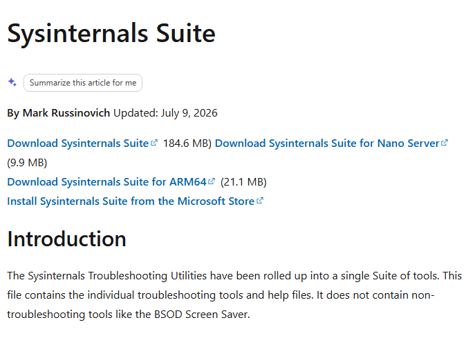
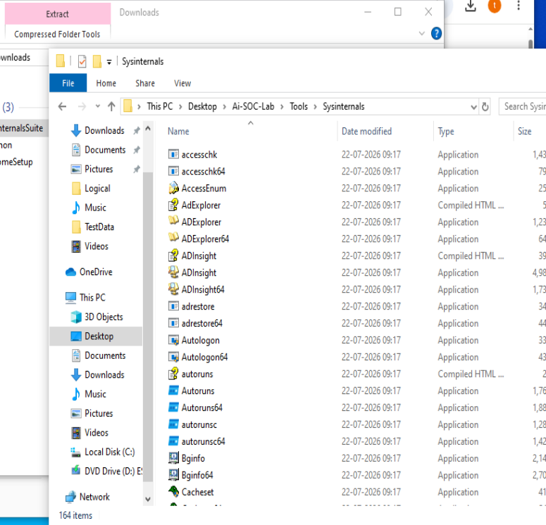
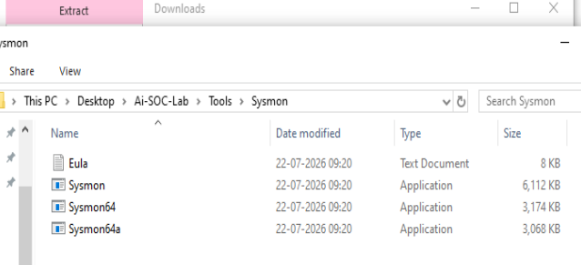
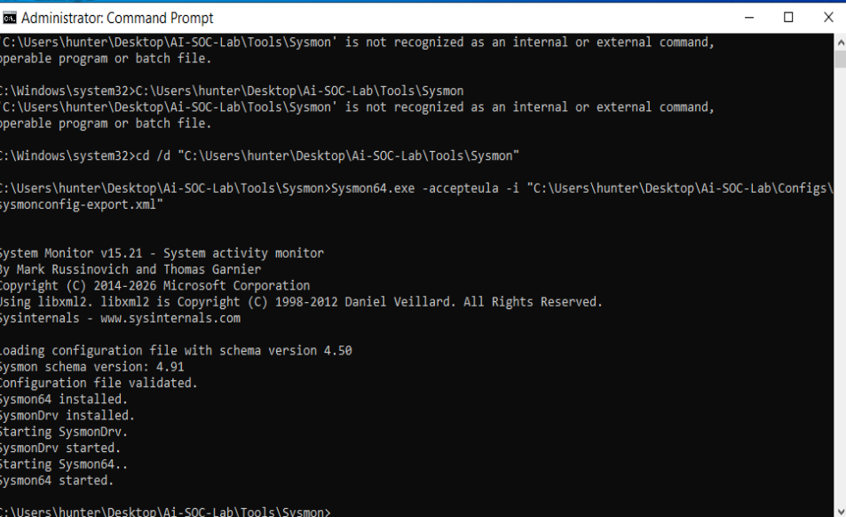
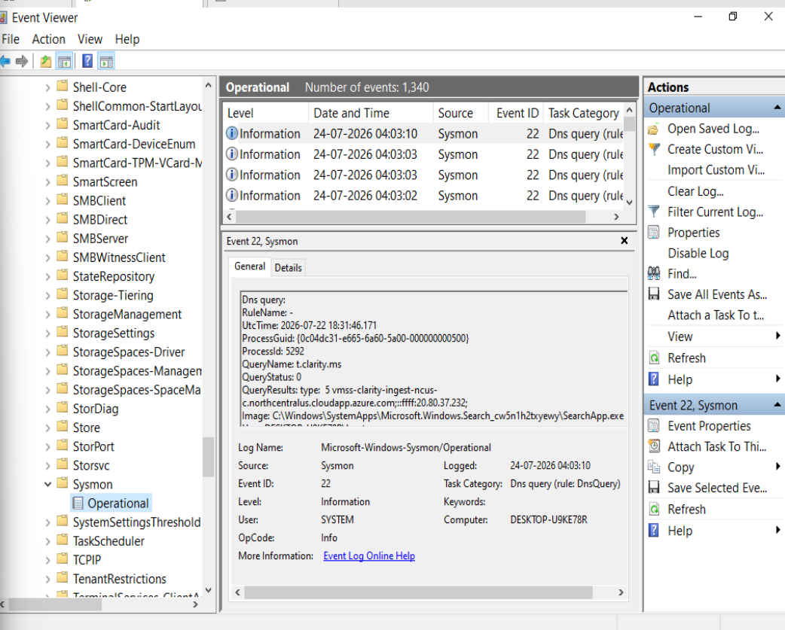
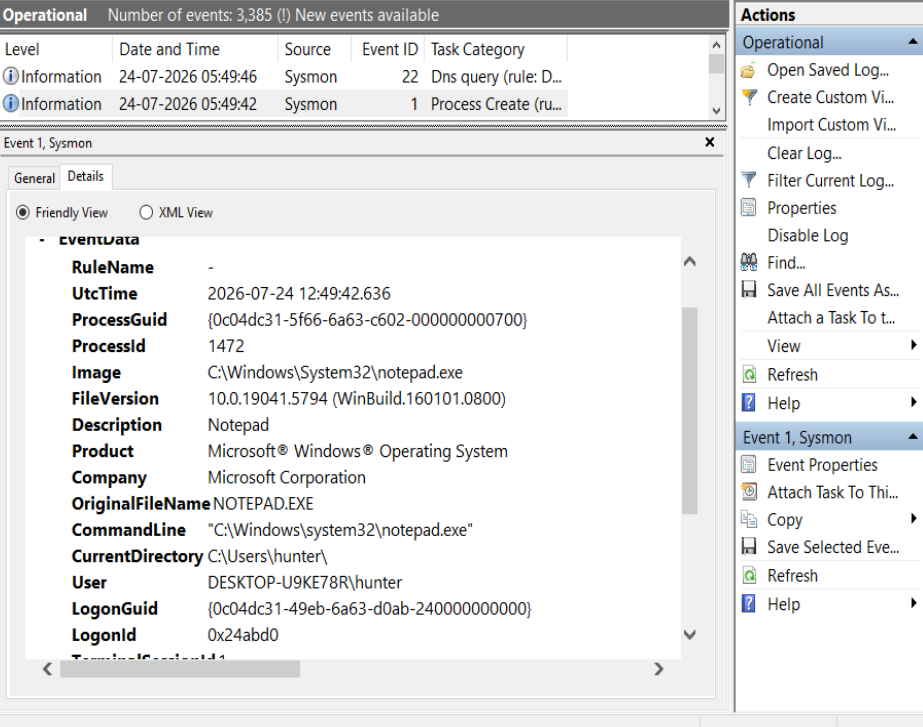
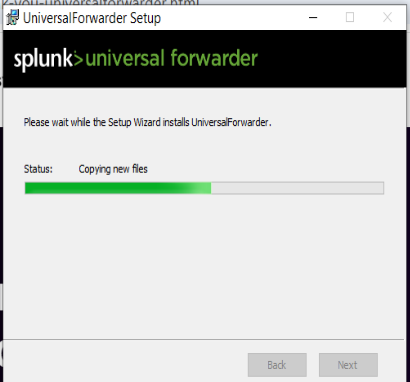
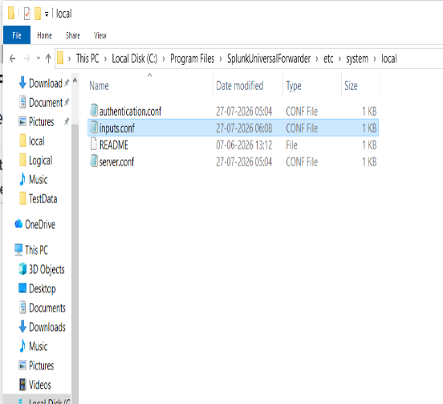
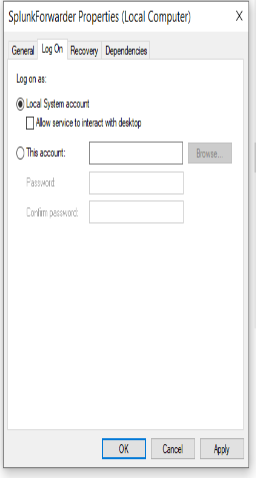
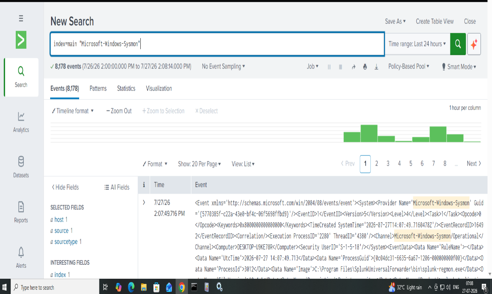

# 🛠️ Installation Guide

## Overview

This document describes the installation and configuration process used to build the endpoint telemetry pipeline for **Phase 01 – Sysmon + Splunk Cloud Integration**.

The objective of this phase was to install Sysmon on a Windows endpoint, configure Splunk Universal Forwarder, and securely forward Windows security events to Splunk Cloud for monitoring and investigation.

---

# Prerequisites

Before starting the installation, the following components were prepared.

| Component | Version / Details |
|-----------|-------------------|
| Operating System | Windows 10 Virtual Machine |
| Sysmon | Sysinternals Sysmon v15 |
| Configuration File | sysmonconfig.xml |
| SIEM Platform | Splunk Cloud |
| Log Forwarder | Splunk Universal Forwarder |
| Internet Connection | Required |

---

# Step 1 — Download Sysmon

Sysmon is part of Microsoft's Sysinternals Suite.

The latest version was downloaded from the official Microsoft Sysinternals website and extracted on the Windows virtual machine.

<p align="center">

</p>

After downloading the archive, the package was extracted to access the Sysmon executable files.

<p align="center">

</p>

The extracted folder contained the required Sysmon executables.

<p align="center">

</p>

---

# Step 2 — Install Sysmon

Sysmon was installed using a custom configuration file (`sysmonconfig.xml`) to enable detailed endpoint event logging.

The installation completed successfully, and the Sysmon service started collecting endpoint events.

<p align="center">

</p>

---

# Step 3 — Verify Event Generation

After installation, Windows Event Viewer was used to verify that Sysmon was generating endpoint telemetry.

The logs were available under:

```text
Applications and Services Logs
└── Microsoft
     └── Windows
          └── Sysmon
               └── Operational
```

<p align="center">

</p>

To validate that process monitoring was functioning correctly, a Process Creation event generated by launching Notepad was inspected.

The event included valuable forensic information such as:

- Process Image
- Command Line
- Parent Process
- User
- Process ID
- Hash Values

<p align="center">

</p>

---

# Step 4 — Install Splunk Universal Forwarder

Splunk Universal Forwarder was installed on the Windows virtual machine to securely forward Sysmon Operational logs to Splunk Cloud.

<p align="center">

</p>

---

# Step 5 — Configure Log Forwarding

The **inputs.conf** file was configured to monitor the **Microsoft-Windows-Sysmon/Operational** event log.

This configuration allows Splunk Universal Forwarder to continuously collect newly generated Sysmon events and send them to Splunk Cloud.

<p align="center">

</p>

During configuration, a service permission issue was identified.

The Splunk Universal Forwarder service was updated to run under the Local System account, allowing it to access the Windows Event Log successfully.

<p align="center">

</p>

---

# Step 6 — Verify Log Ingestion

After restarting the Splunk Universal Forwarder service, Sysmon events began appearing in Splunk Cloud.

Successful log ingestion confirmed that endpoint telemetry was being forwarded correctly from the Windows endpoint to the SIEM platform.

<p align="center">

</p>

---

# Installation Outcome

At the end of this installation process:

- ✅ Sysmon was successfully installed.
- ✅ Endpoint telemetry was generated.
- ✅ Splunk Universal Forwarder was configured.
- ✅ Sysmon Operational logs were forwarded successfully.
- ✅ Splunk Cloud received endpoint events.
- ✅ The telemetry pipeline was successfully validated.

The Windows endpoint is now ready for the next phases of the AI Security Operations Center project, including detection engineering, threat hunting, and incident investigation.
