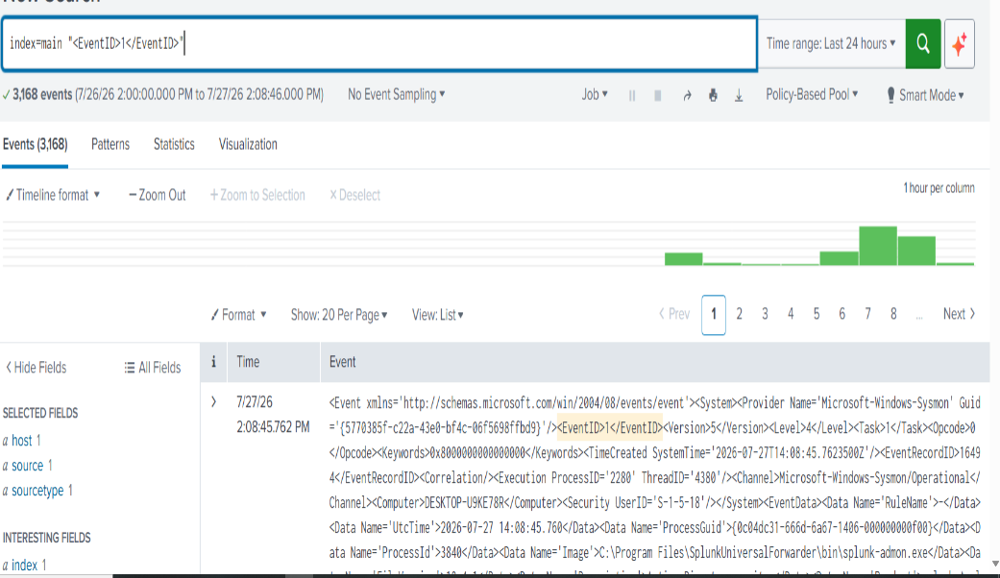
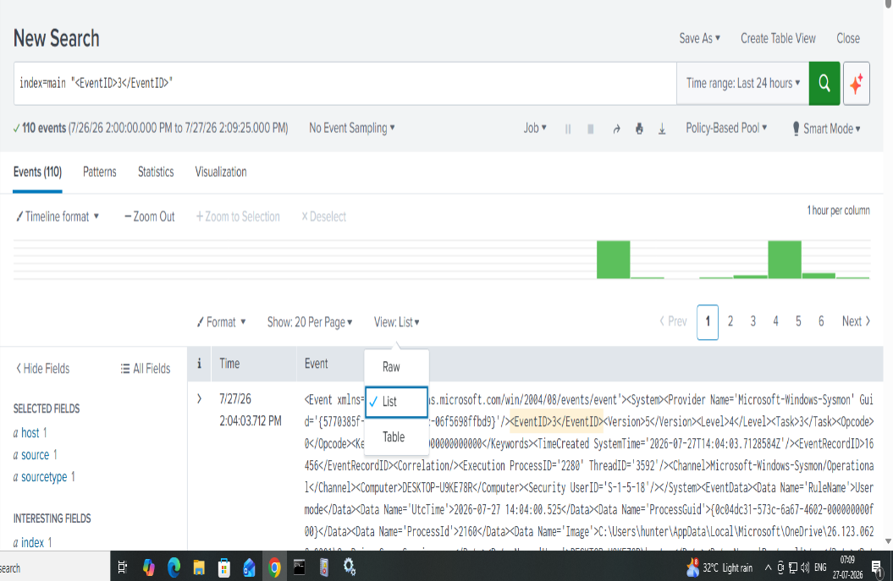

# 🛡️ Phase 01 – Sysmon + Splunk Cloud Integration


## Overview

The first phase of this AI Security Operations Center (AI-SOC) project focuses on collecting endpoint telemetry from a Windows machine and forwarding it to Splunk Cloud for monitoring and investigation.

I used Sysmon to generate detailed Windows security events and configured Splunk Universal Forwarder to securely send those logs to Splunk Cloud.

After completing the configuration, I verified that Sysmon events were successfully reaching the SIEM and validated them using different Event IDs.

This phase establishes the endpoint telemetry pipeline that will be used throughout the remaining AI-SOC project.

---

## Objectives

- Install Sysmon on a Windows endpoint
- Generate endpoint telemetry
- Configure Splunk Universal Forwarder
- Forward Sysmon Operational logs to Splunk Cloud
- Verify successful log ingestion
- Perform basic event validation using Splunk searches

---

# 🖥️ Environment

| Component | Details |
|-----------|----------|
| Operating System | Windows 10 Virtual Machine |
| Log Collection | Sysmon v15 |
| Log Forwarding | Splunk Universal Forwarder |
| SIEM | Splunk Cloud |
| Event Source | Microsoft-Windows-Sysmon/Operational |

---

# 🏗️ Project Workflow

The workflow below shows how endpoint telemetry travels from the Windows endpoint to Splunk Cloud.

```text
                Windows 10 VM
                      │
                      ▼
                  Sysmon
                      │
                      ▼
      Microsoft-Windows-Sysmon
          Operational Event Log
                      │
                      ▼
      Splunk Universal Forwarder
                      │
                      ▼
               Splunk Cloud SIEM
                      │
                      ▼
      Search • Investigation • Analysis
```

---

# 🛠️ Step 1 — Installing Sysmon

Sysmon was installed using a custom configuration file to generate detailed endpoint telemetry.

After the installation completed successfully, the Sysmon service started automatically and began writing events into the Windows Event Log.

<p align="center">

</p>

---

# ✅ Step 2 — Verifying Sysmon

After installing Sysmon, I verified that the service was successfully generating Windows security events.

The logs were available under:

```text
Applications and Services Logs
└── Microsoft
     └── Windows
          └── Sysmon
               └── Operational
```

The Operational log contained multiple event types including:

- Process Creation
- DNS Queries
- Registry Events
- File Creation Events

<p align="center">

</p>

To confirm that Sysmon was collecting detailed process telemetry, I inspected a Process Creation event generated after launching Notepad.

The event included valuable forensic information such as:

- Process Image
- Command Line
- Parent Process
- Process ID
- User Context
- Hash Values

<p align="center">

</p>

---

# 🚀 Step 3 — Configuring Splunk Universal Forwarder

To centralize endpoint telemetry, Splunk Universal Forwarder was installed on the Windows machine.

<p align="center">

</p>

After installation, the **inputs.conf** file was configured to monitor the Sysmon Operational Event Log.

<p align="center">

</p>

Once the forwarder service was restarted, Sysmon events began appearing inside Splunk Cloud.

This confirmed that endpoint telemetry was successfully being forwarded from the Windows endpoint to the SIEM.

<p align="center">

</p>

---

# 🔎 Step 4 — Event Validation

After confirming successful log ingestion, I performed several searches inside Splunk Cloud to verify that the forwarded telemetry contained the expected Windows events.

## Event ID 1 — Process Creation

To generate a Process Creation event, I launched **Notepad** on the endpoint.

Splunk successfully captured the corresponding Sysmon Process Creation event.

<p align="center">

</p>

---

## Event ID 3 — Network Connection

Next, I searched for **Event ID 3**, which records network connection activity generated by Sysmon.

The event was successfully returned by Splunk, confirming that network-related telemetry was also being collected correctly.

<p align="center">

</p>

Both Event ID 1 and Event ID 3 were successfully searchable, confirming that the Sysmon telemetry pipeline was functioning correctly.

---

# 🎯 Skills Demonstrated

- Windows Endpoint Monitoring
- Sysmon Configuration
- Windows Event Logging
- Splunk Universal Forwarder
- Splunk Cloud
- Event Validation
- Security Log Analysis
- Basic Endpoint Investigation

---

# 📚 Project Documentation

This phase also includes detailed documentation for installation, architecture and troubleshooting.

- 📄 Installation Guide
- 💻 Commands Reference
- 🏗️ Architecture Overview
- 🛠️ Troubleshooting Notes

---

# ✅ Phase Summary

In this phase, I successfully built an endpoint logging pipeline using Sysmon and Splunk Cloud.

The project demonstrates how Windows endpoint telemetry can be collected, securely forwarded to a SIEM platform, and validated using real security events.

This serves as the foundation for the upcoming phases of the AI Security Operations Center project, where these logs will be used for detection engineering, threat hunting, alerting, and automated incident response.
